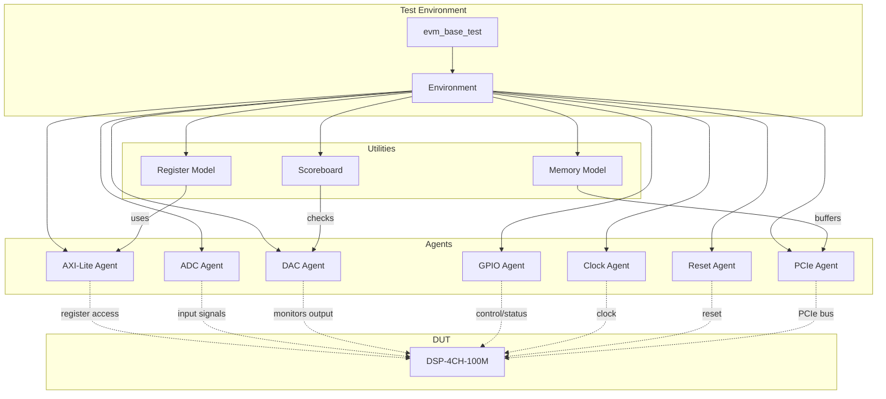
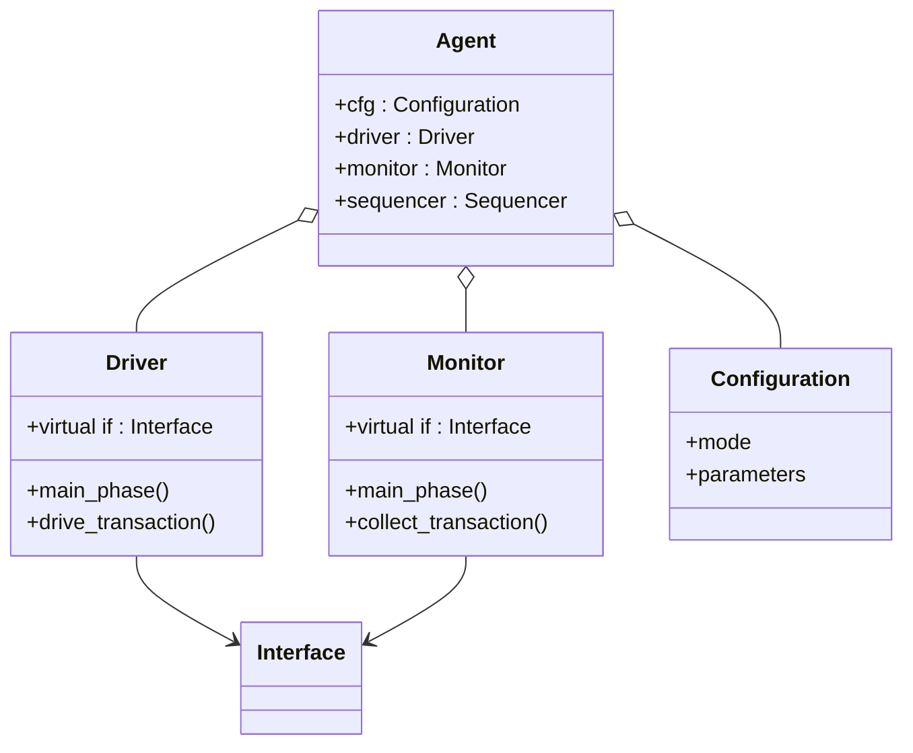
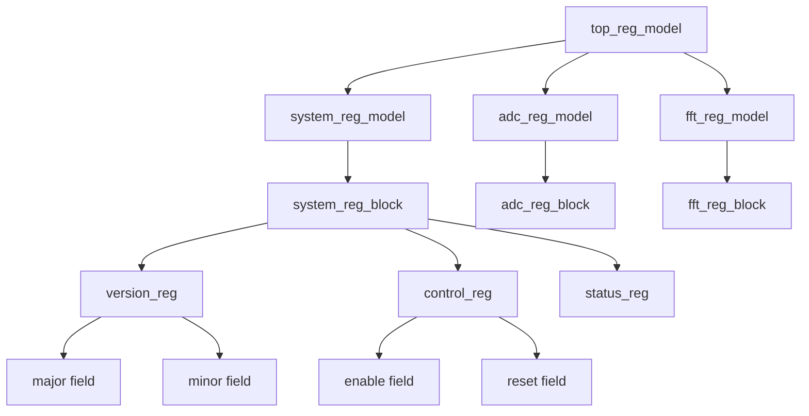
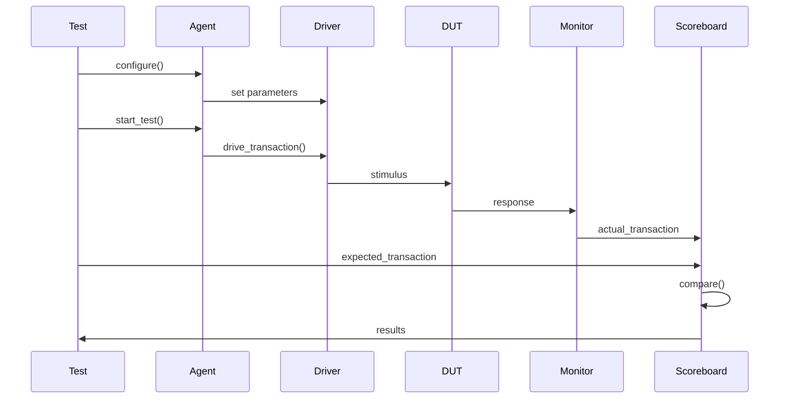

# EVM Framework UML Diagram

## Class Hierarchy

```mermaid
classDiagram
    %% Base Classes
    class evm_object {
        <<abstract>>
        +string name
        +new(name)
        +log_info()
        +log_warning()
        +log_error()
        +convert2string()
        +get_type_name()
    }
    
    class evm_component {
        <<abstract>>
        +evm_component parent
        +build_phase()
        +connect_phase()
        +run_phase()
        +final_phase()
    }
    
    class evm_agent {
        <<abstract>>
        +evm_mode_e mode
        +evm_driver driver
        +evm_monitor monitor
        +set_mode()
        +create_driver()*
        +create_monitor()*
    }
    
    class evm_driver {
        <<abstract>>
        +virtual if vif
        +main_phase()
    }
    
    class evm_monitor {
        <<abstract>>
        +virtual if vif
        +main_phase()
    }
    
    class evm_sequencer {
        +sequence_queue
        +start_sequence()
    }
    
    %% Inheritance
    evm_component --|> evm_object
    evm_agent --|> evm_component
    evm_driver --|> evm_component
    evm_monitor --|> evm_component
    evm_sequencer --|> evm_component
    
    %% Register Model
    class evm_reg_field {
        +string name
        +int lsb, width
        +evm_reg_access_e access
        +bit[63:0] reset_value
        +read()
        +write()
    }
    
    class evm_reg {
        +string name
        +bit[63:0] address
        +evm_reg_field fields[$]
        +add_field()
        +read()
        +write()
        +mirror()
    }
    
    class evm_reg_block {
        +string name
        +bit[63:0] base_addr
        +evm_reg registers[$]
        +evm_component agent
        +add_reg()
        +set_agent()
        +reset()
    }
    
    evm_reg_field --|> evm_object
    evm_reg --|> evm_object
    evm_reg_block --|> evm_object
    evm_reg o-- evm_reg_field : contains
    evm_reg_block o-- evm_reg : contains
    
    %% Stream Agent
    class evm_stream_agent {
        +evm_stream_cfg cfg
        +generate_stimulus()
        +analyze_capture()
    }
    
    class evm_stream_cfg {
        +string python_gen_script
        +string python_analyze_script
        +string stimulus_file
        +string capture_file
    }
    
    evm_stream_agent --|> evm_agent
    evm_stream_agent o-- evm_stream_cfg
    
    %% AXI-Lite Agent
    class evm_axi_lite_agent {
        +evm_axi_lite_cfg cfg
    }
    
    class evm_axi_lite_cfg {
        +evm_axi_mode_e mode
        +int master_delay_min
        +int master_delay_max
        +int back_to_back_pct
    }
    
    evm_axi_lite_agent --|> evm_agent
    evm_axi_lite_agent o-- evm_axi_lite_cfg
    
    %% ADC Agent
    class evm_adc_agent {
        +evm_adc_cfg adc_cfg
        +configure_channel()
        +enable_channel()
        +generate_adc_stimulus()
    }
    
    class evm_adc_cfg {
        +real sample_rate_hz
        +int num_channels
        +bit auto_generate_stimulus
        +bit auto_analyze_results
    }
    
    evm_adc_agent --|> evm_stream_agent
    evm_adc_agent o-- evm_adc_cfg
    
    %% DAC Agent
    class evm_dac_agent {
        +evm_dac_cfg dac_cfg
        +analyze_dac_spectrum()
        +analyze_dac_thd()
        +analyze_dac_snr()
    }
    
    class evm_dac_cfg {
        +real sample_rate_hz
        +int max_capture_samples
        +bit enable_fft_analysis
        +bit enable_thd_analysis
    }
    
    evm_dac_agent --|> evm_stream_agent
    evm_dac_agent o-- evm_dac_cfg
    
    %% GPIO Agent
    class evm_gpio_agent {
        +evm_gpio_cfg cfg
        +set_pin()
        +set_pins()
        +toggle_pin()
    }
    
    class evm_gpio_cfg {
        +int num_pins
        +bit[31:0] default_input_value
    }
    
    evm_gpio_agent --|> evm_agent
    evm_gpio_agent o-- evm_gpio_cfg
    
    %% Clock Agent
    class evm_clk_agent {
        +evm_clk_cfg cfg
        +set_frequency()
    }
    
    evm_clk_agent --|> evm_agent
    
    %% Reset Agent
    class evm_rst_agent {
        +evm_rst_cfg cfg
        +apply_pcie_reset()
        +apply_sys_reset()
    }
    
    evm_rst_agent --|> evm_agent
    
    %% PCIe Agent
    class evm_pcie_agent {
        +evm_pcie_cfg cfg
        +configure()
        +link_training()
        +mem_write()
        +mem_read()
    }
    
    evm_pcie_agent --|> evm_agent
    
    %% Utilities
    class evm_memory_model {
        +byte memory[longint]
        +longint memory_size
        +write_byte()
        +write_word()
        +read_byte()
        +read_word()
        +load_from_file()
        +save_to_file()
    }
    
    class evm_scoreboard~T~ {
        +evm_scoreboard_mode_e mode
        +T expected_queue[$]
        +T actual_queue[$]
        +insert_expected()
        +insert_actual()
        +check_transaction()
        +compare_transactions()*
        +print_report()
    }
    
    evm_memory_model --|> evm_object
    evm_scoreboard --|> evm_component
```

## Component Relationships

## Agent Internal Structure

## Register Model Hierarchy

## Data Flow

## Key Design Patterns

1. **Factory Pattern**: Agents create drivers and monitors
2. **Observer Pattern**: Monitors observe interfaces
3. **Strategy Pattern**: Scoreboard matching modes
4. **Template Method**: Base class phases
5. **Singleton**: Configuration objects

