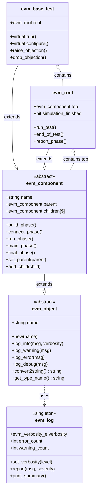
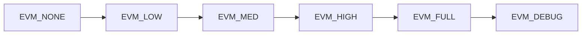
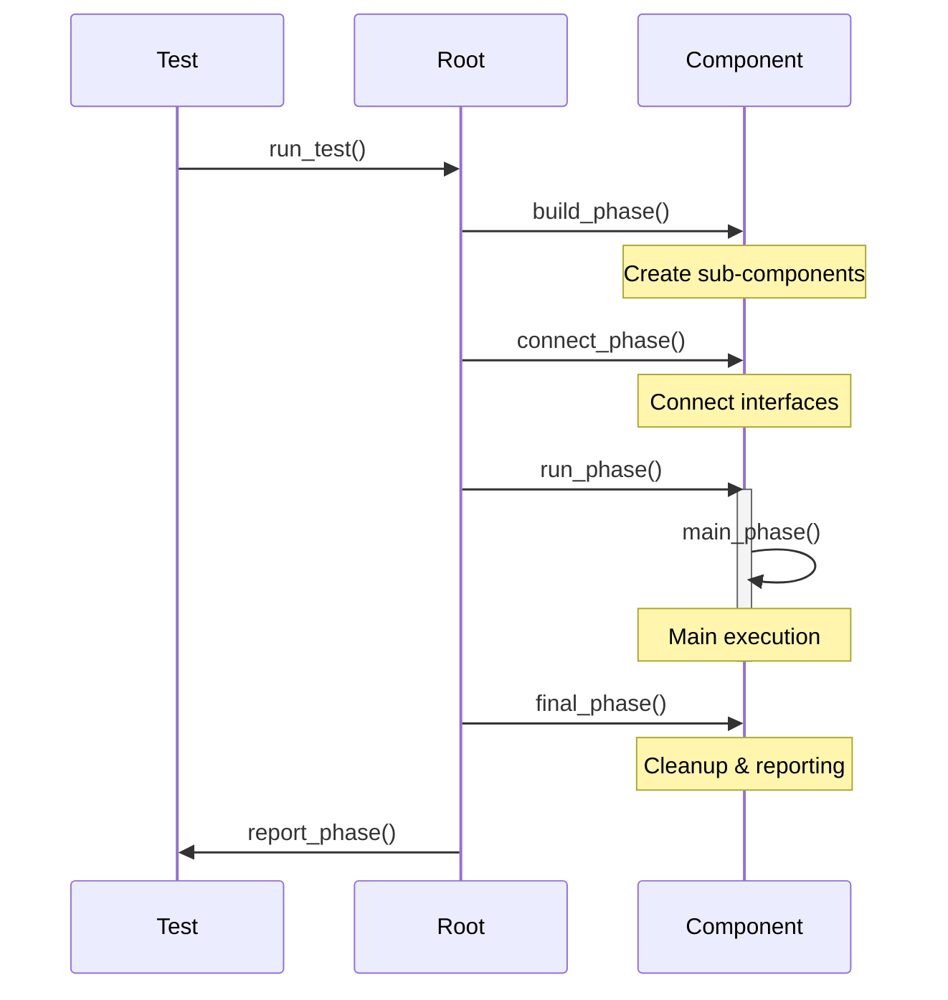

# EVM Base Components

## Core Base Classes

## Verbosity Levels

## Phase Execution Flow

## Key Features

### evm_object
- Base class for all EVM objects
- Provides logging infrastructure
- String conversion for debugging
- Type identification

### evm_component  
- Phased execution model
- Hierarchical structure (parent/children)
- Build, connect, run, final phases
- Supports component reuse

### evm_log
- Centralized logging system
- Configurable verbosity levels
- Error and warning counters
- Summary reporting

### evm_base_test
- Test base class
- Objection mechanism
- Configuration hooks
- Test orchestration

### evm_root
- Top-level simulation controller
- Phase coordinator
- Manages test lifecycle
- End-of-test handling
