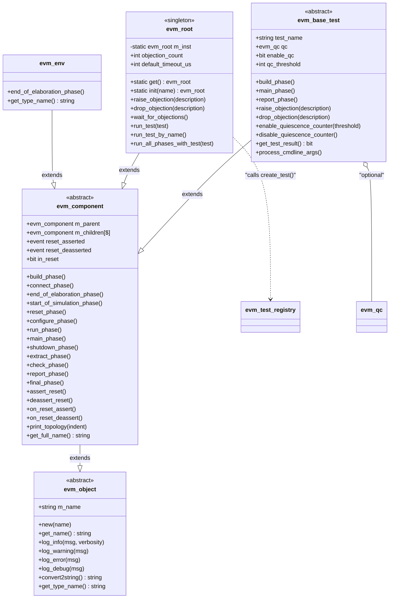
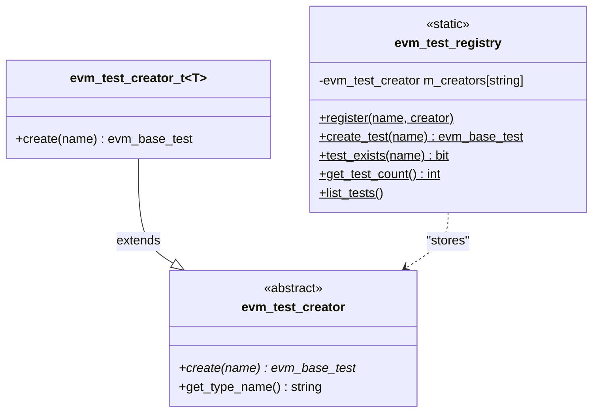
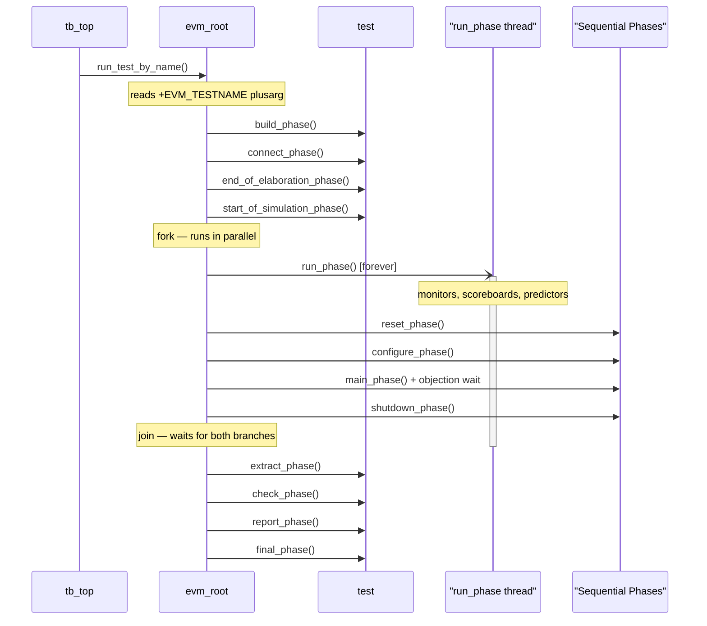
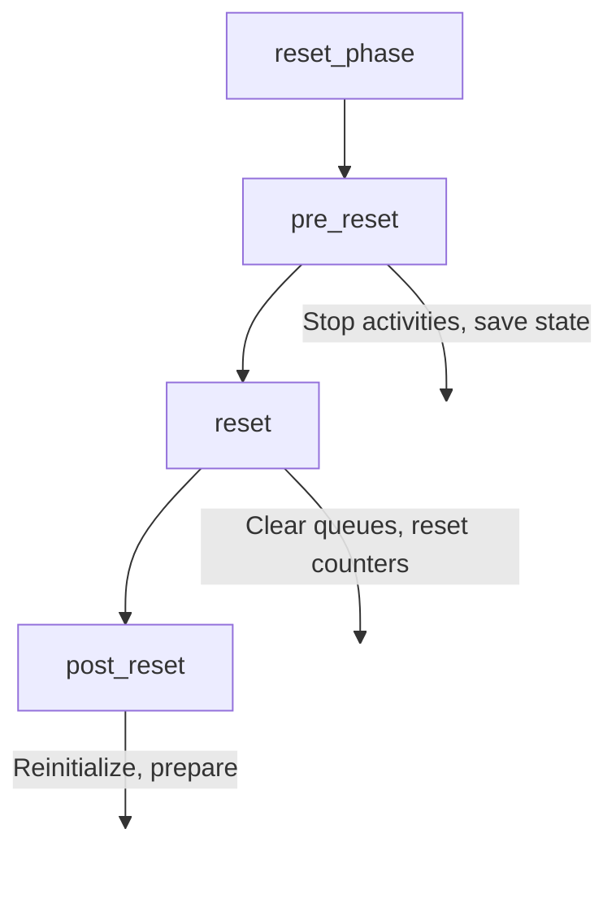
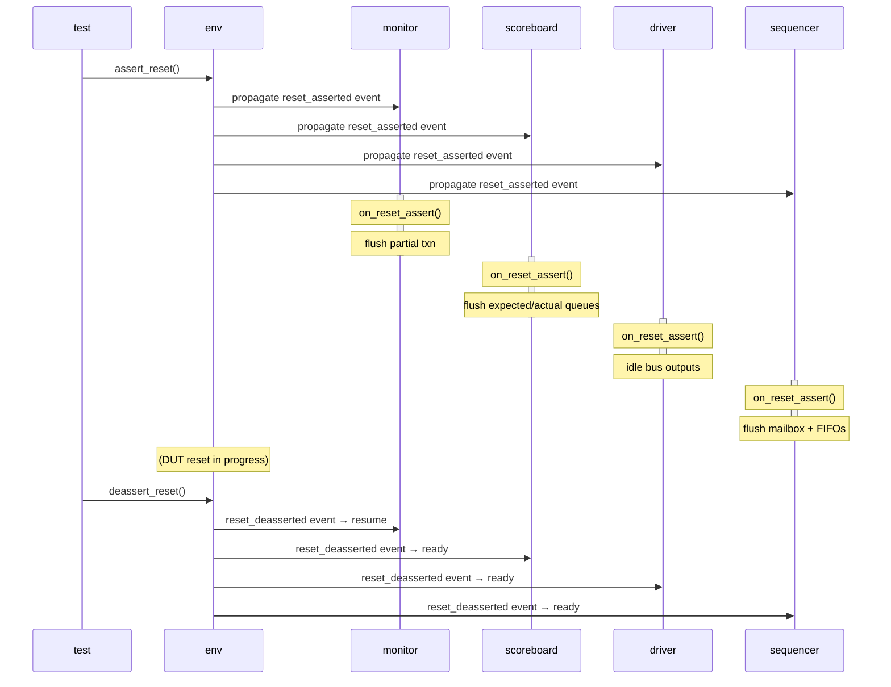
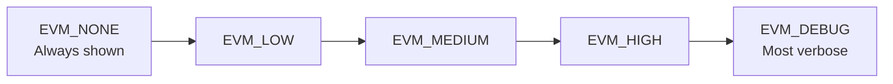
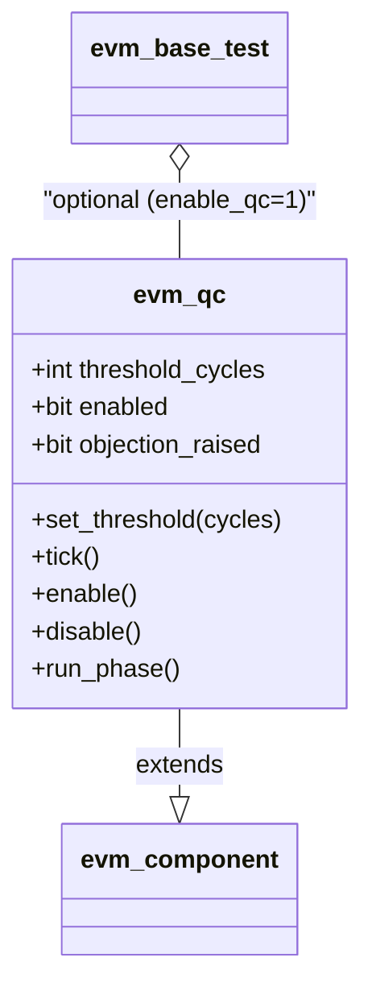
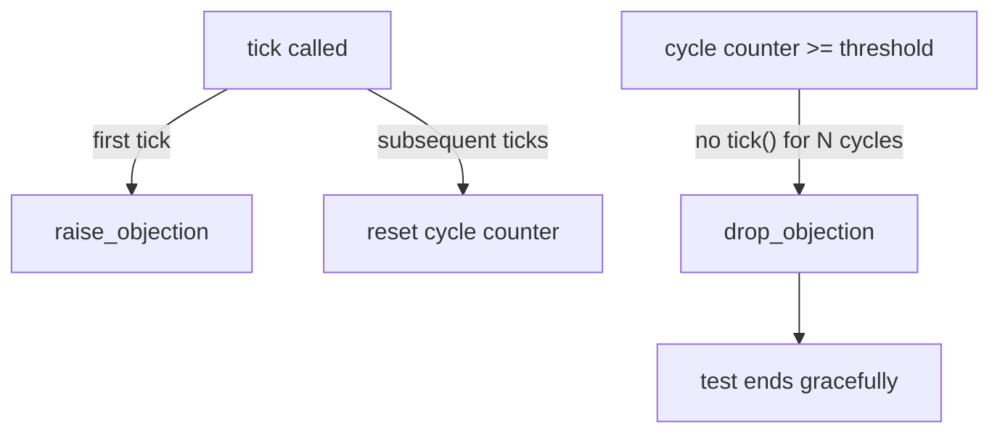

# EVM Core Framework

**Author:** Eric Dyer (Differential Audio Inc.)  
**Last Updated:** 2026-04-09  

---

## Full Class Hierarchy

---

## Test Registry

**Macro** `EVM_REGISTER_TEST(TNAME)` — registers type at time 0 via `initial` block.

---

## 12-Phase System + Parallel run_phase

---

## Reset Sub-Phase Architecture

---

## Mid-Simulation Reset Event Flow

---

## Verbosity Levels

---

## Quiescence Counter (QC) — Unique EVM Feature

**Flow:**

