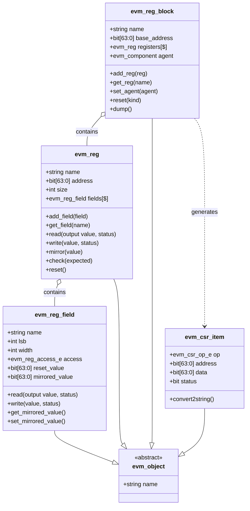
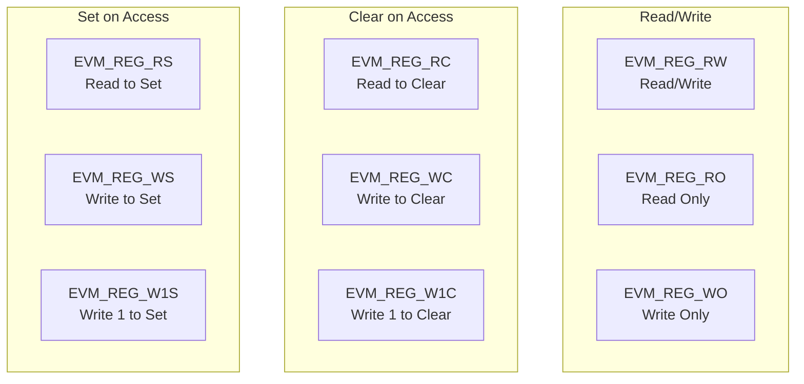
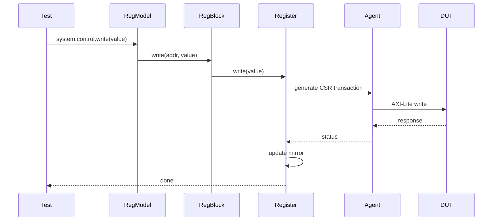

# EVM Register Abstraction Layer (RAL)

## Register Model Class Hierarchy



## Field Access Types



## Register Model Hierarchy Example

```mermaid
graph TD
    TOP[top_reg_model]
    
    TOP --> SYS[system_reg_model]
    TOP --> ADC[adc_reg_model]
    TOP --> FFT[fft_reg_model]
    
    SYS --> SYS_BLK[system_reg_block<br/>base: 0x00000000]
    ADC --> ADC_BLK[adc_reg_block<br/>base: 0x00010000]
    FFT --> FFT_BLK[fft_reg_block<br/>base: 0x00020000]
    
    SYS_BLK --> VER[version_reg<br/>offset: 0x00]
    SYS_BLK --> CTRL[control_reg<br/>offset: 0x04]
    SYS_BLK --> STAT[status_reg<br/>offset: 0x08]
    
    VER --> MAJOR[major: [31:24] RO]
    VER --> MINOR[minor: [23:16] RO]
    VER --> PATCH[patch: [15:8] RO]
    
    CTRL --> EN[enable: [0] RW]
    CTRL --> RST[reset: [1] RW]
    CTRL --> DBG[debug: [2] RW]
    
    STAT --> RDY[ready: [0] RO]
    STAT --> ERR[error: [1] RC]
    STAT --> LOCK[locked: [2] RO]
```

## Register Access Flow



## Key Features

### evm_reg_field
- Represents individual bit field
- 9 access types (RW, RO, WO, RC, RS, WC, WS, W1C, W1S)
- Reset and mirrored values
- Automatic field extraction

### evm_reg
- Contains multiple fields
- Address offset within block
- Read/write/mirror/check methods
- Field-level access

### evm_reg_block
- Collection of registers
- Base address management
- Agent association
- Block-level operations

### Auto-Generated Models
- CSR generator creates RAL from YAML
- Per-module register models
- Top-level aggregation model
- Type-safe access methods

## Usage Example

```systemverilog
// Create and configure
top_reg_model ral = new();
ral.configure(axi_agent);

// Write register
ral.system.control.write(32'h0003, status);

// Read register
ral.system.status.read(value, status);

// Field-level access
ral.system.control.enable.write(1, status);

// Mirror check
ral.system.status.mirror(actual_value);
if (ral.system.status.check(expected)) begin
    $display("Match!");
end
```
