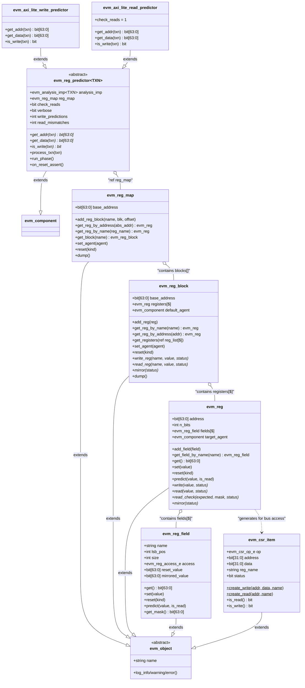
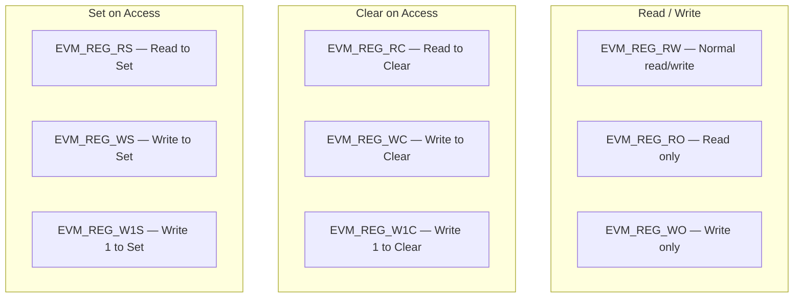
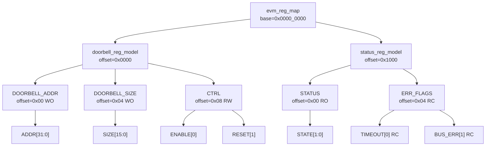
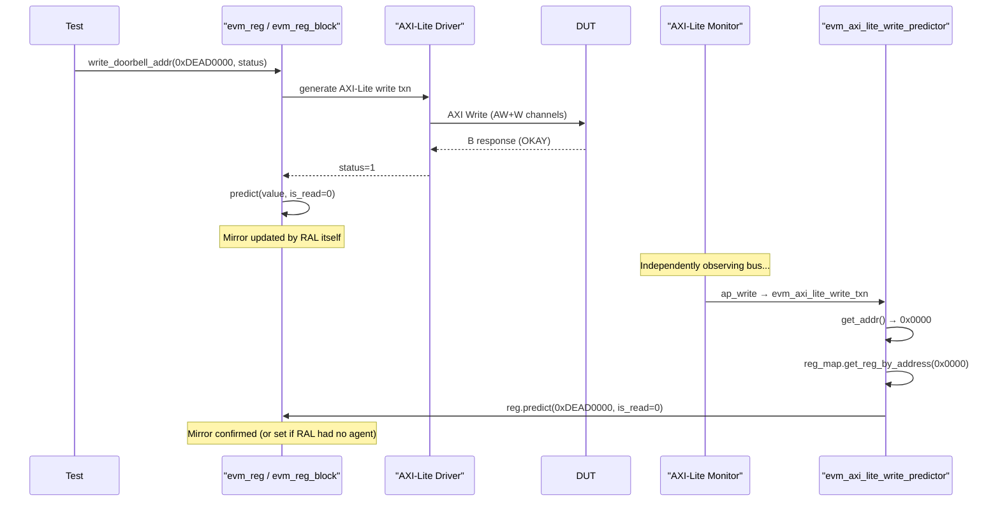
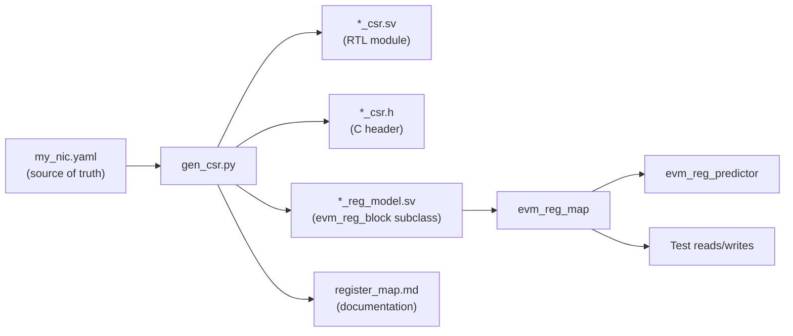

# EVM Register Model (RAL)

**Author:** Eric Dyer (Differential Audio Inc.)  
**Last Updated:** 2026-04-09  

---

## Complete RAL Class Hierarchy

---

## Field Access Types

---

## Address Map Hierarchy Example

---

## Register Write Flow with Predictor Auto-Sync

---

## CSR Generator Integration

