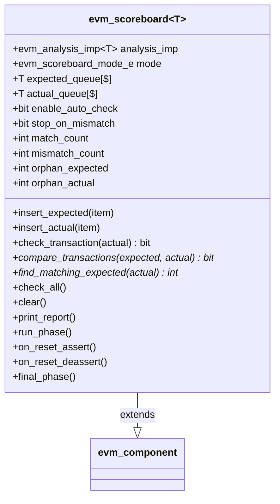
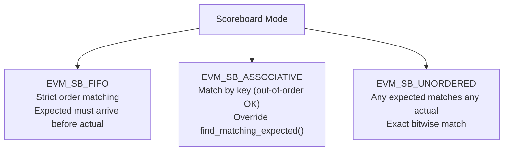
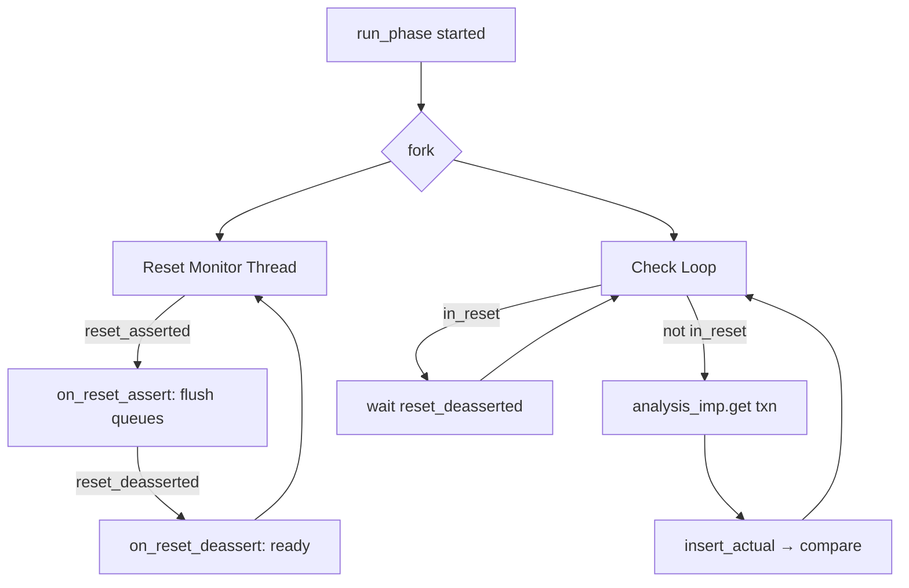
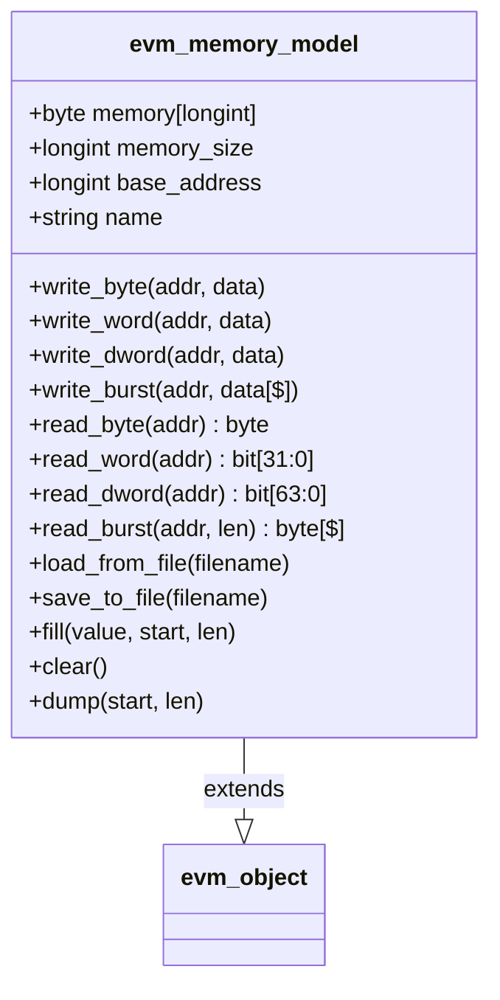
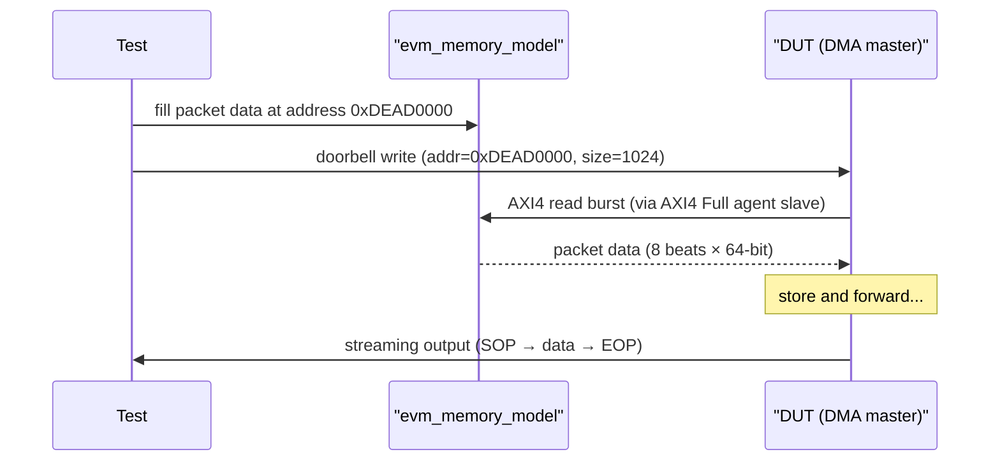
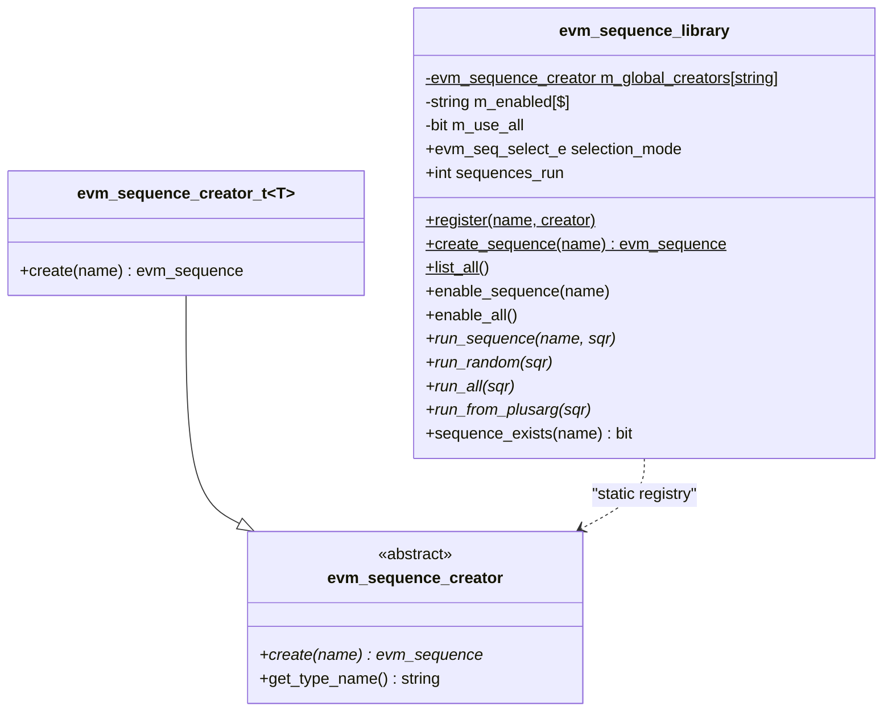
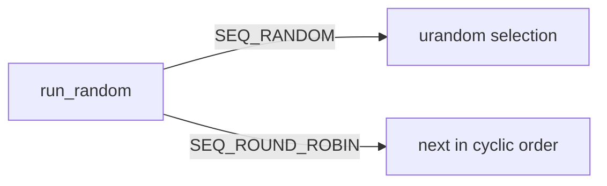
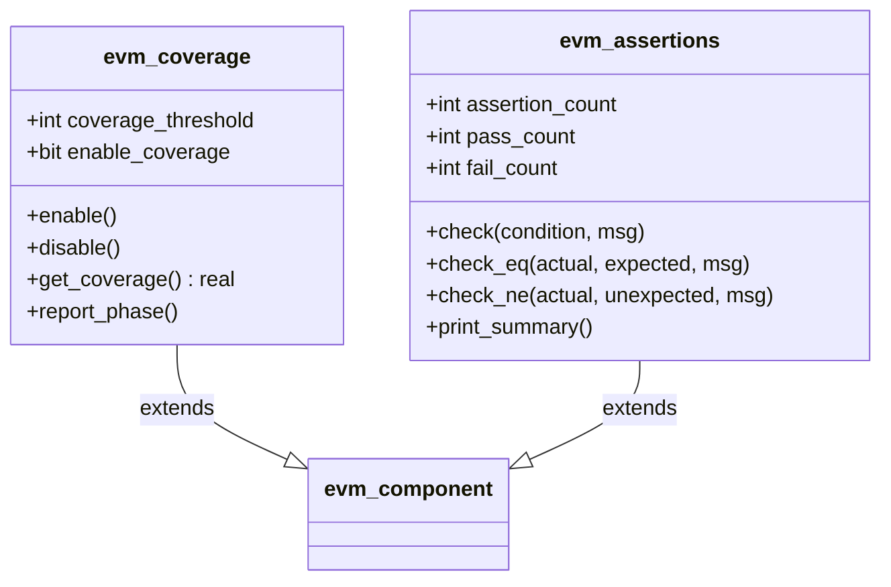

# EVM Utilities

**Author:** Eric Dyer (Differential Audio Inc.)  
**Last Updated:** 2026-04-09  

---

## Scoreboard

**Three matching modes:**

**run_phase() operation:**

---

## Memory Model

**Usage for DMA simulation:**

---

## Sequence Library

**Selection modes:**

---

## Coverage and Assertion Infrastructure

