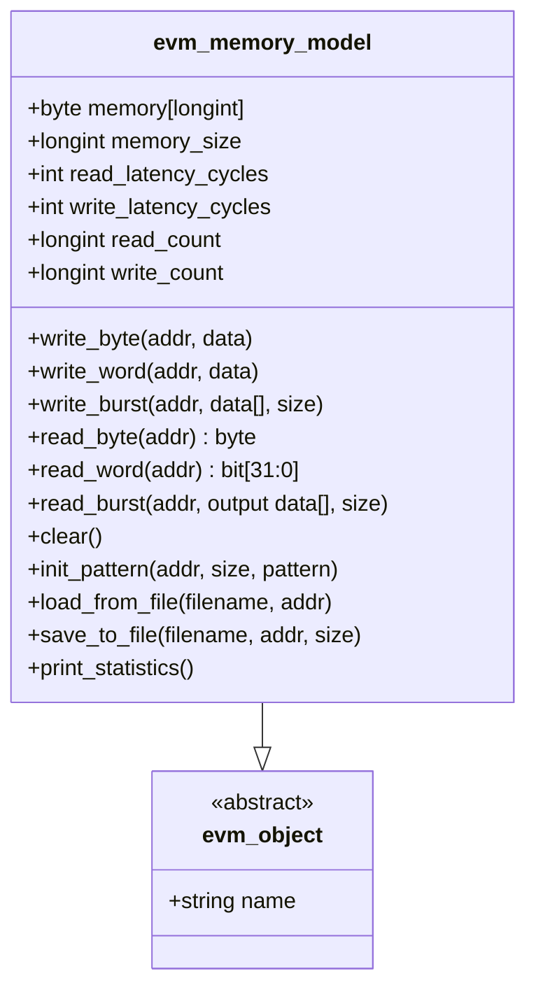
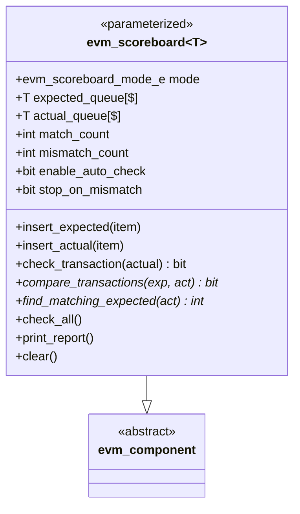
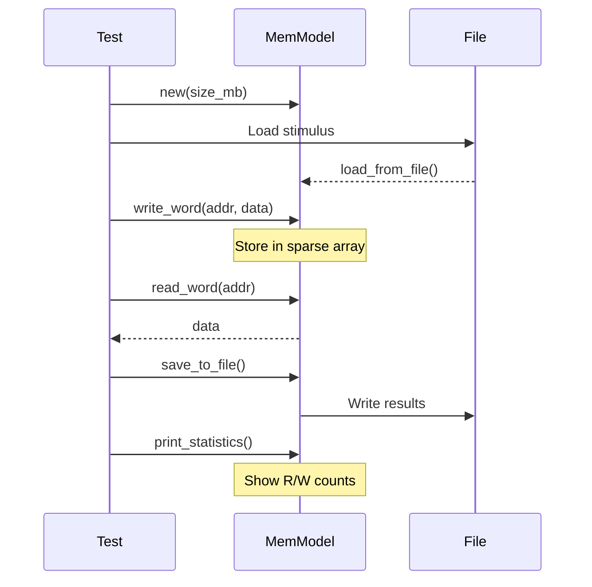
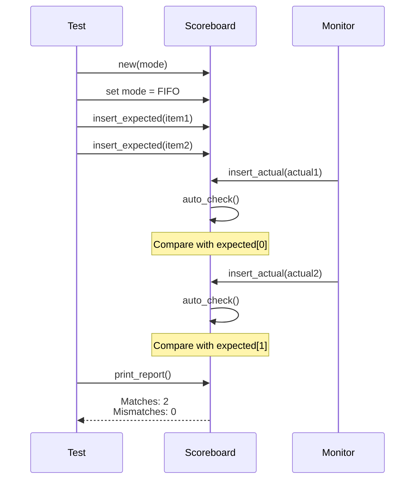

# EVM Utilities

## Memory Model



## Scoreboard



## Scoreboard Matching Modes

```mermaid
graph TD
    SB[Scoreboard]
    
    SB --> FIFO[EVM_SB_FIFO<br/>Strict FIFO Order]
    SB --> ASSOC[EVM_SB_ASSOCIATIVE<br/>Match by Key]
    SB --> UNORD[EVM_SB_UNORDERED<br/>Any Match]
    
    FIFO --> F1[Expected[0] must match Actual[0]]
    FIFO --> F2[Expected[1] must match Actual[1]]
    
    ASSOC --> A1[Find by key/ID]
    ASSOC --> A2[Out-of-order OK]
    
    UNORD --> U1[Match any expected<br/>with any actual]
```

## Memory Model Usage Flow



## Scoreboard Usage Flow



## Memory Model Features

### Sparse Array
- Only stores written locations
- Efficient for large address spaces
- 64MB default size

### File I/O
- Load stimulus from files
- Save results for analysis
- Hex format support

### Statistics
- Read/write counters
- Byte tracking
- Performance metrics

### Latency Modeling
- Configurable read/write latency
- Realistic memory timing
- Burst support

## Scoreboard Features

### Multiple Matching Modes
- **FIFO**: Strict order matching
- **Associative**: Match by key/ID
- **Unordered**: Any-to-any matching

### Auto-Check
- Automatic comparison on insert_actual()
- Immediate feedback
- Optional deferred checking

### Statistics & Reporting
- Match/mismatch counters
- Orphan detection (expected or actual with no match)
- Pass rate calculation
- Detailed reporting

### Customization
- Virtual compare_transactions() method
- Override for custom comparison logic
- Virtual find_matching_expected() for key-based matching

## Usage Examples

### Memory Model
```systemverilog
// Create 64MB memory
evm_memory_model mem = new("ddr_model", 64*1024*1024);

// Load stimulus
mem.load_from_file("stimulus.hex", 32'h00000000);

// Write/read
mem.write_word(32'h00001000, 32'hDEADBEEF);
data = mem.read_word(32'h00001000);

// Save results
mem.save_to_file("results.hex", 32'h00002000, 1024);
mem.print_statistics();
```

### Scoreboard
```systemverilog
// Create parameterized scoreboard
evm_scoreboard#(my_transaction) sb = new("sb");
sb.mode = EVM_SB_FIFO;
sb.enable_auto_check = 1;

// Insert expected
sb.insert_expected(exp_trans1);
sb.insert_expected(exp_trans2);

// Monitor inserts actual (auto-checked)
sb.insert_actual(act_trans1);  // Compared immediately
sb.insert_actual(act_trans2);

// Final report
sb.print_report();  // Shows matches/mismatches
```
