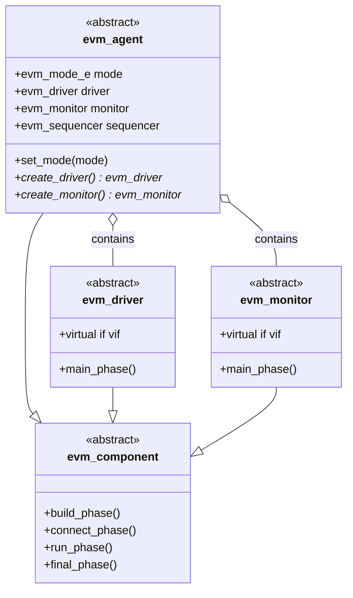
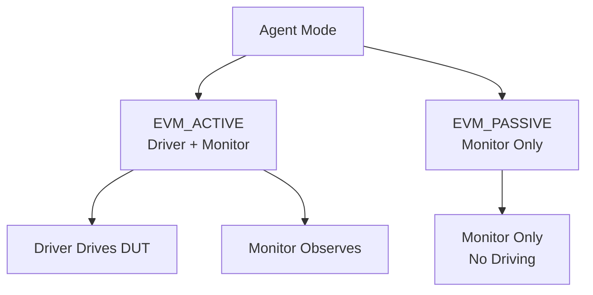
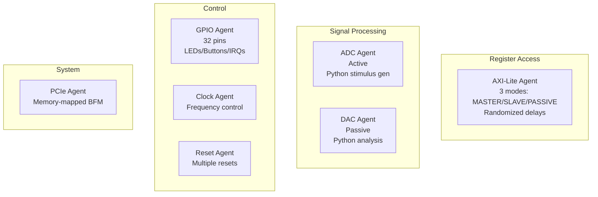
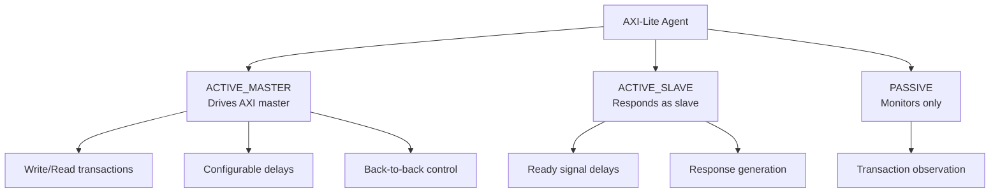
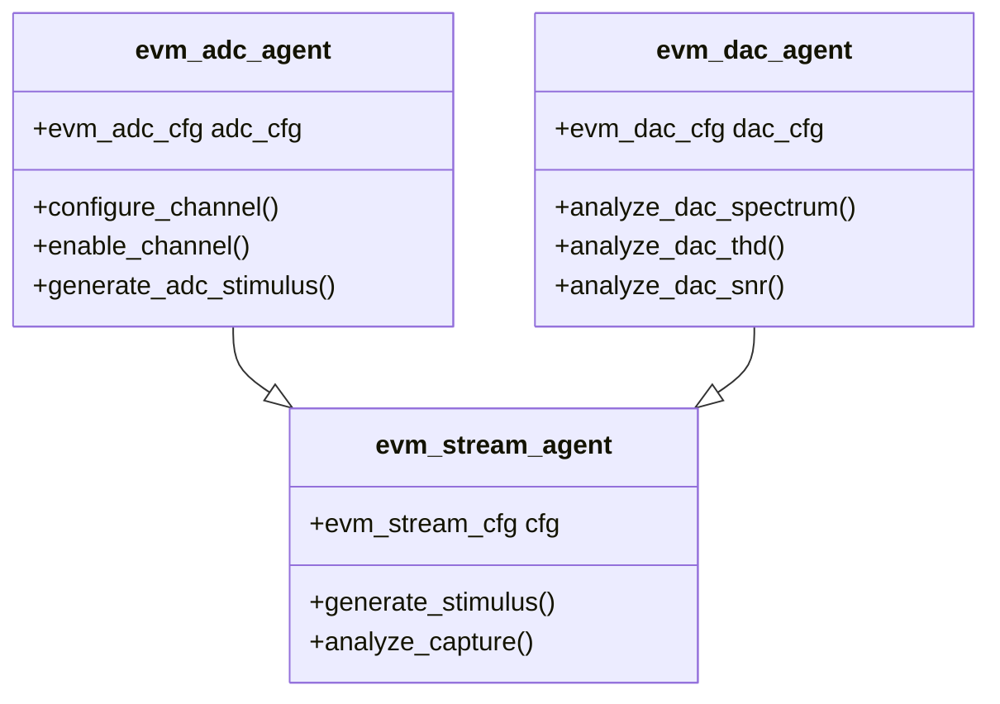
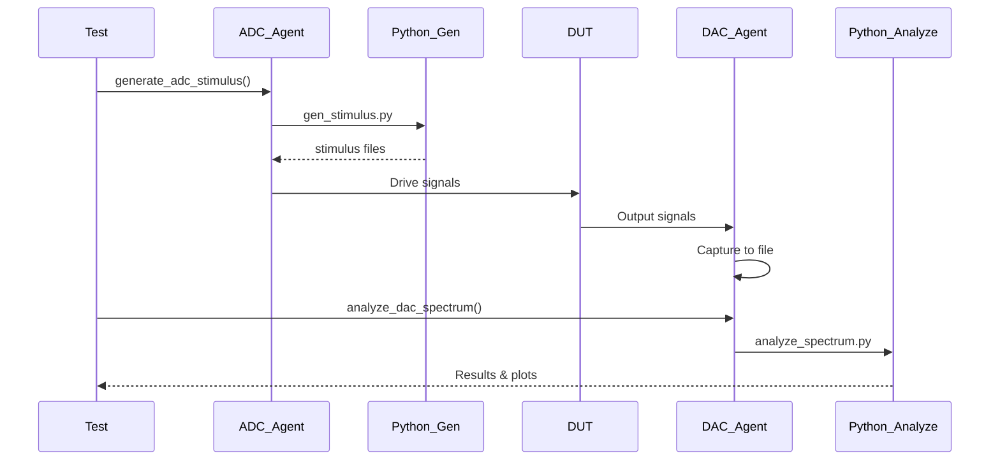
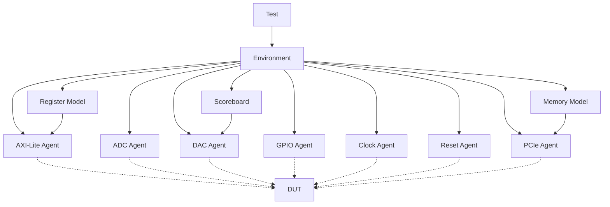

# EVM Agents Overview

## Agent Base Architecture



## Agent Modes



## Protocol Agents Summary



## AXI-Lite Agent Modes



## Streaming Agents (ADC/DAC)



## Python Integration Flow



## Agent Usage Examples

### AXI-Lite Master Mode
```systemverilog
// Create and configure
evm_axi_lite_agent axi_agent = new();
axi_agent.cfg.mode = EVM_AXI_ACTIVE_MASTER;
axi_agent.cfg.master_delay_min = 0;
axi_agent.cfg.master_delay_max = 2;
axi_agent.cfg.back_to_back_pct = 80;

// Connect interface
axi_agent.set_interface(axi_if);
axi_agent.build();

// Use with register model
ral.configure(axi_agent);
ral.system.control.write(32'h0003, status);
```

### ADC Agent (Active)
```systemverilog
// Create and configure
evm_adc_agent adc_agent = new();
adc_agent.set_sample_rate(100e6);
adc_agent.enable_auto_generate(1);

// Configure channels
adc_agent.configure_channel(0, 1.0e6, 2047.0);  // 1 MHz sine
adc_agent.configure_channel(1, 2.0e6, 1024.0);  // 2 MHz sine
adc_agent.enable_all_channels();

// Stimulus auto-generated before sim
// Driver streams data to DUT
```

### DAC Agent (Passive)
```systemverilog
// Create and configure
evm_dac_agent dac_agent = new();
dac_agent.set_sample_rate(100e6);
dac_agent.set_capture_samples(16384);
dac_agent.enable_auto_analyze(1);
dac_agent.enable_fft_analysis(1);
dac_agent.enable_thd_analysis(1);

// Monitor captures output
// Analysis auto-runs after sim
```

### GPIO Agent
```systemverilog
// Create and configure
evm_gpio_agent gpio_agent = new();

// Set individual pins
gpio_agent.set_pin(0, 1);  // LED on
gpio_agent.set_pin(1, 0);  // LED off

// Set multiple pins
gpio_agent.set_pins(32'h0000_000F);  // Lower 4 bits

// Toggle pin
gpio_agent.toggle_pin(2);
```

## Test Environment Structure



## Key Agent Features

### AXI-Lite
- 3 operating modes
- Randomized timing
- Protocol checking
- Register model integration

### ADC
- Python stimulus generation
- Multi-channel support
- Configurable sample rate
- Signal generation (sine, etc.)

### DAC
- Passive capture only
- Python analysis (FFT, THD, SNR)
- Multi-channel monitoring
- File output

### GPIO
- 32-pin control
- LED/button support
- Interrupt monitoring
- Toggle tracking

### Clock/Reset
- Frequency control
- Multiple reset types
- Synchronization support

### PCIe
- Memory-mapped BFM
- Simple read/write
- Link training
- Configuration space
