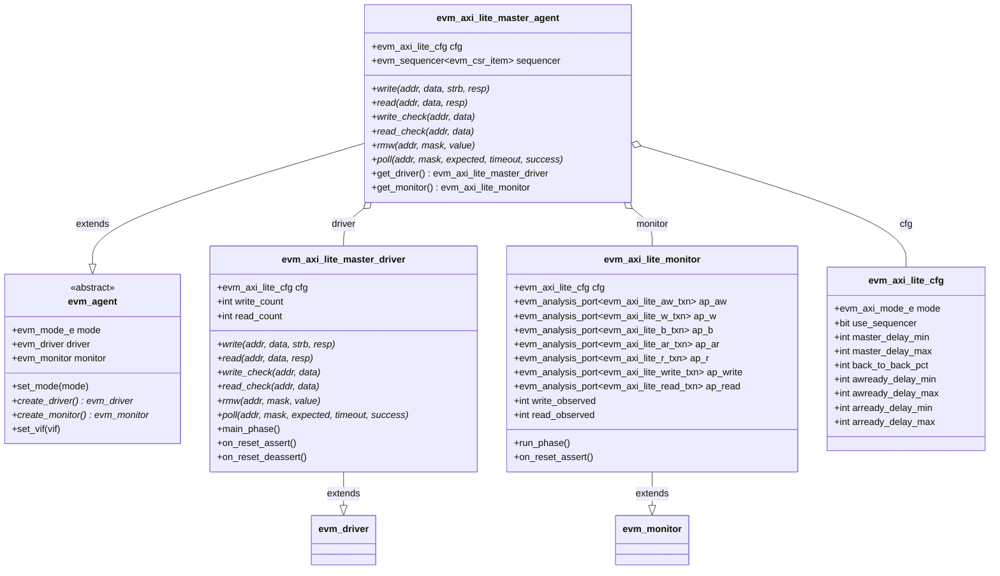
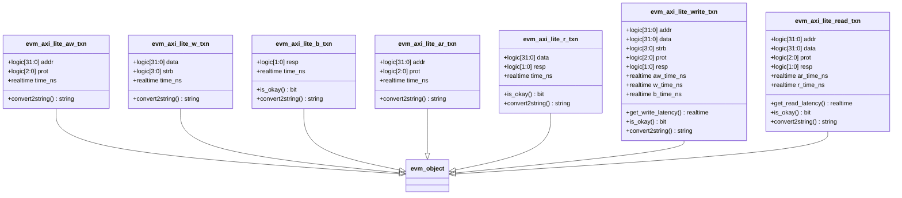
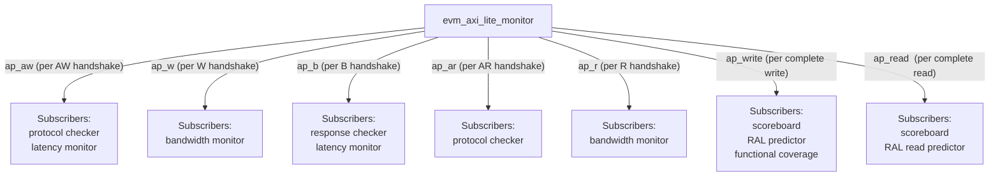
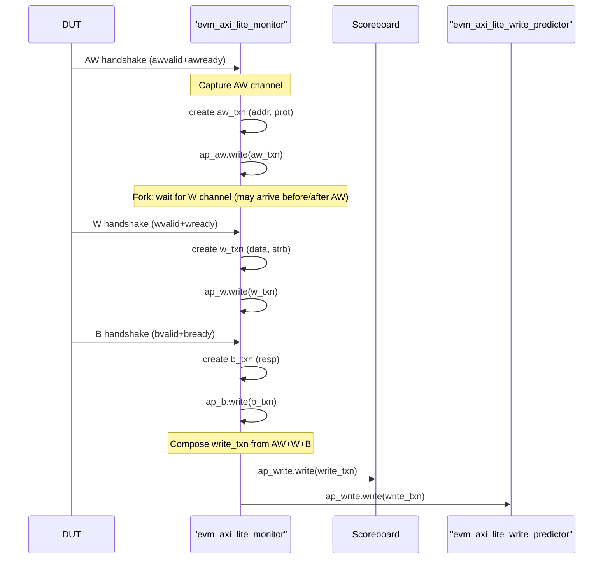
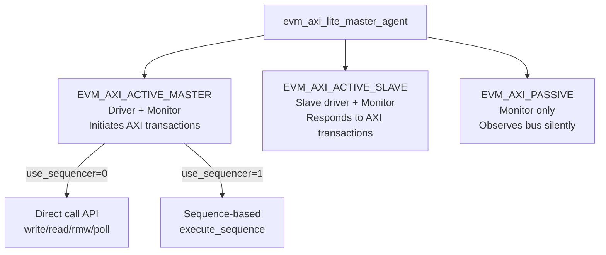
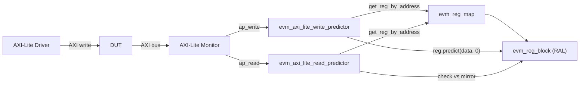

# EVM AXI4-Lite Agent

**Author:** Eric Dyer (Differential Audio Inc.)  
**Last Updated:** 2026-04-09  

---

## AXI4-Lite Agent Class Hierarchy

---

## Transaction Types

---

## Monitor Analysis Port Connections

---

## Write Transaction Monitoring Flow

---

## Agent Modes

---

## RAL Predictor Integration

