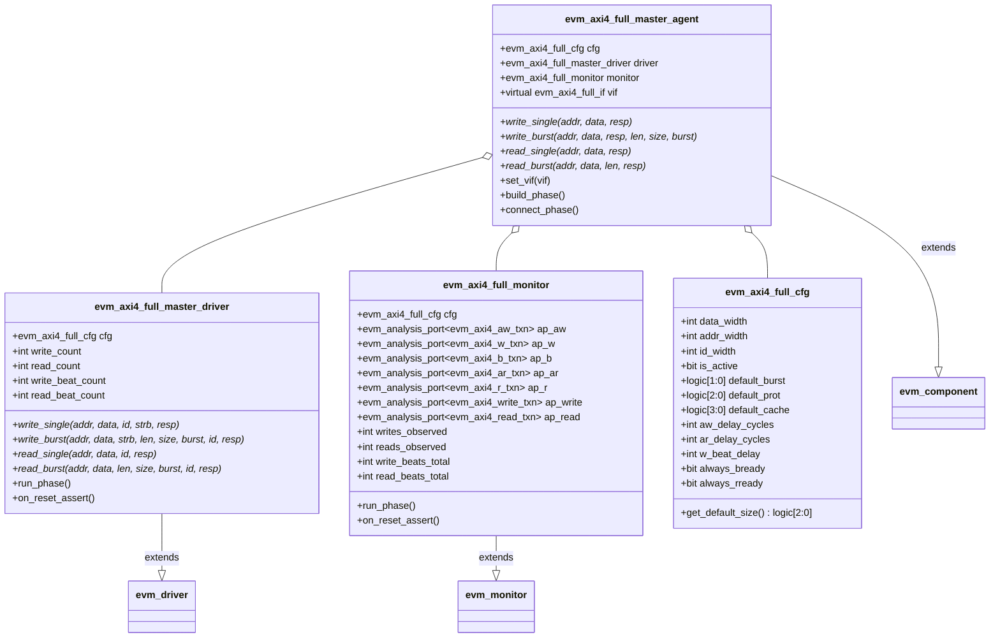
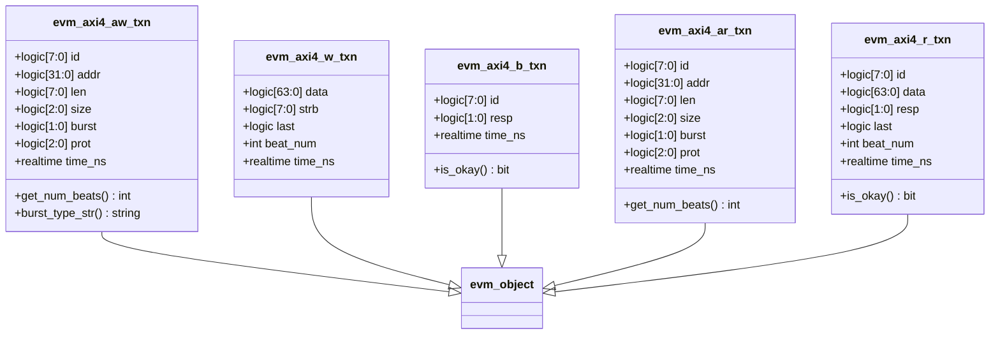
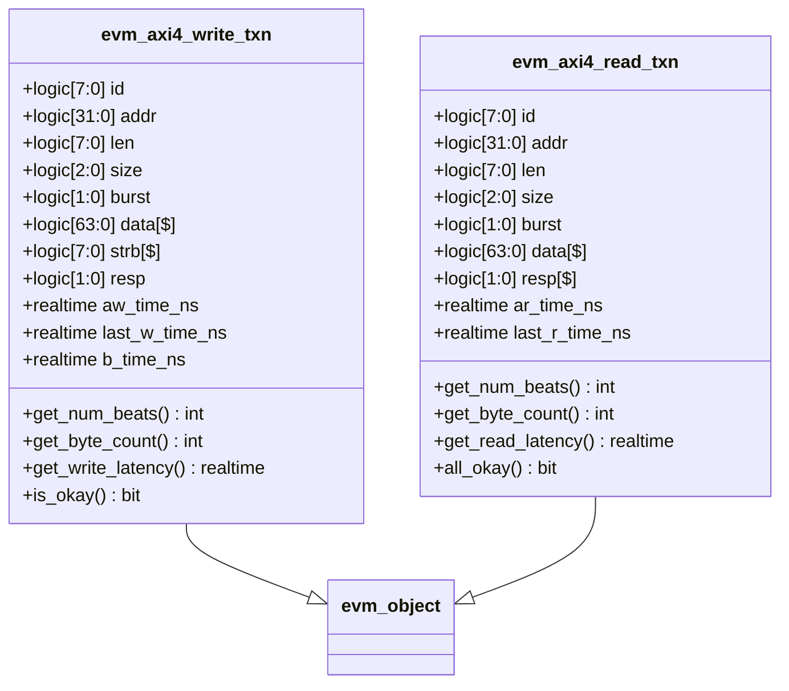
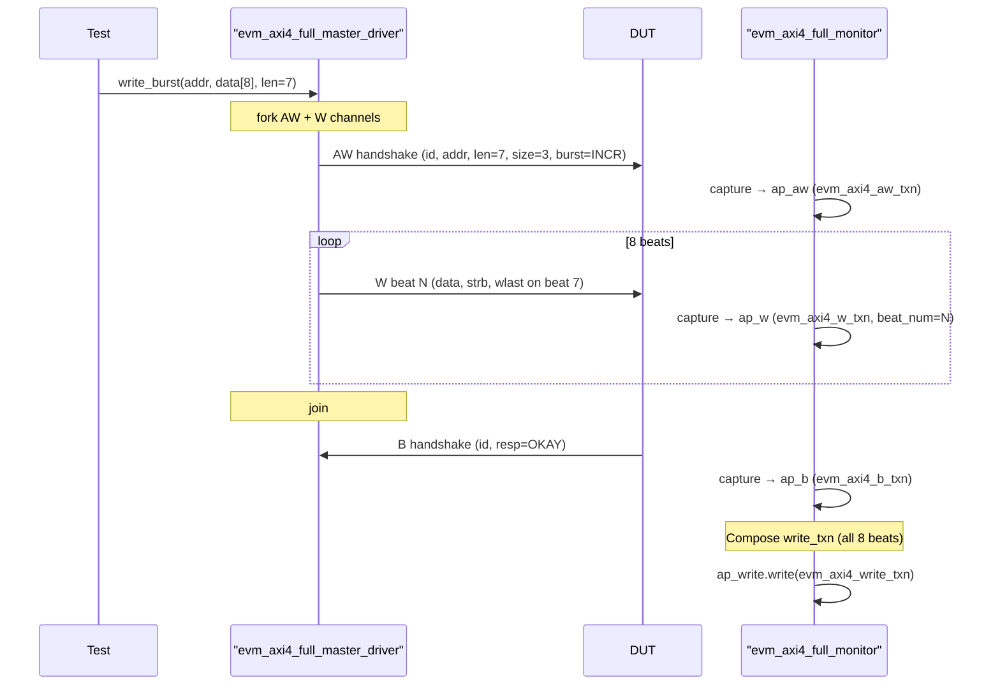
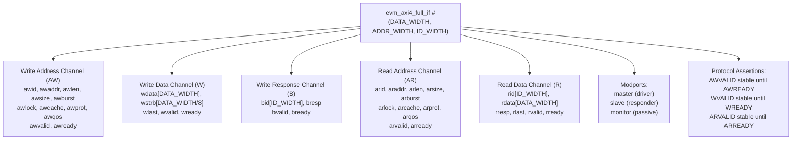
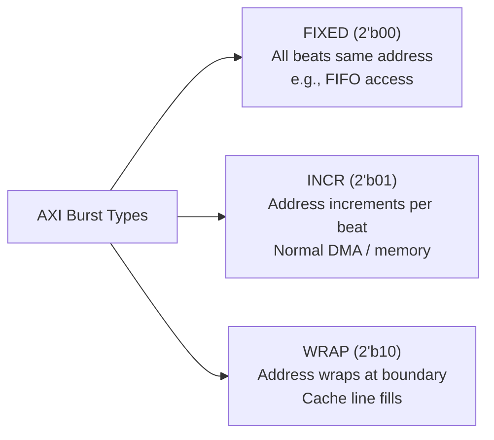

# EVM AXI4 Full Agent

**Author:** Eric Dyer (Differential Audio Inc.)  
**Last Updated:** 2026-04-09  

---

## AXI4 Full Agent Class Hierarchy

---

## Transaction Types

### Channel-Level (one per AXI handshake)

### Composite (one per complete burst transaction)

---

## Write Burst Sequence Diagram

---

## Interface Parameters

---

## Burst Type Reference

**AWSIZE / ARSIZE encoding:**
| Value | Bytes per beat |
|---|---|
| 3'b000 | 1 byte |
| 3'b001 | 2 bytes |
| 3'b010 | 4 bytes |
| 3'b011 | 8 bytes (64-bit default) |
| 3'b100 | 16 bytes |
