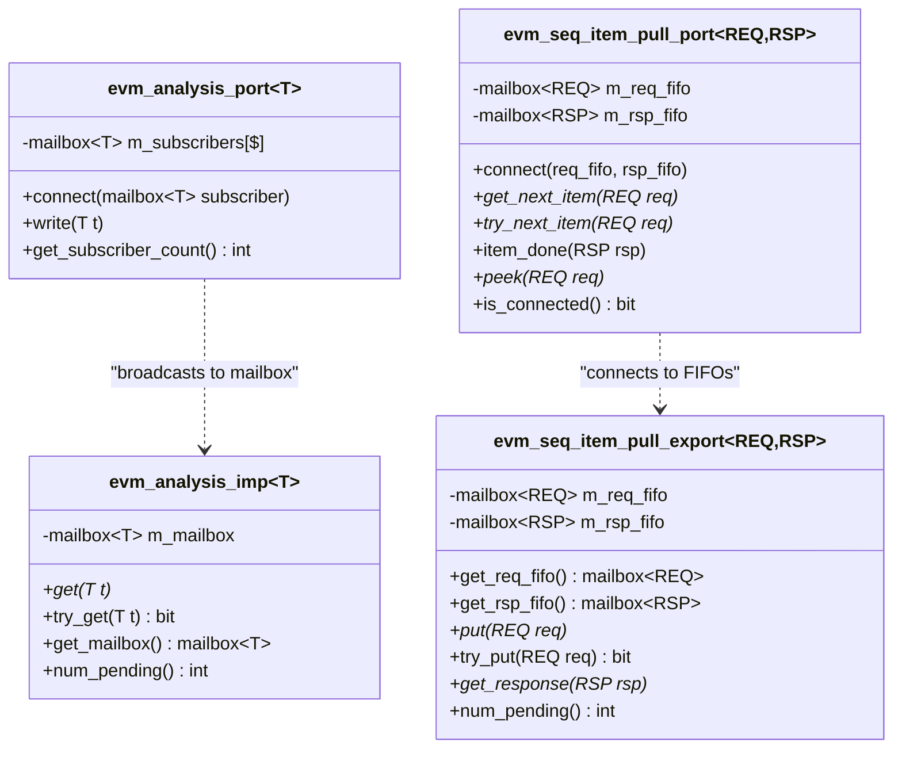
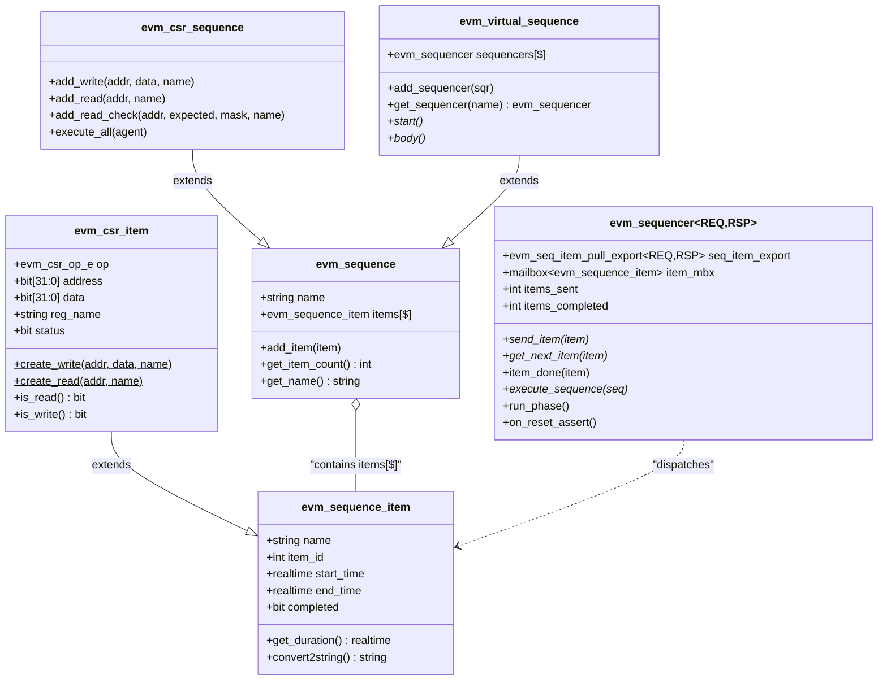
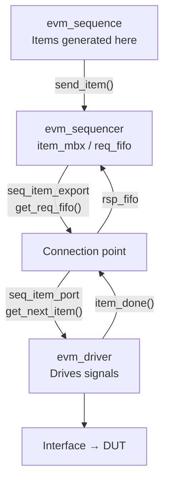
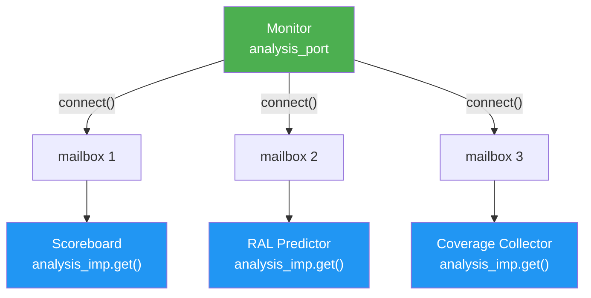
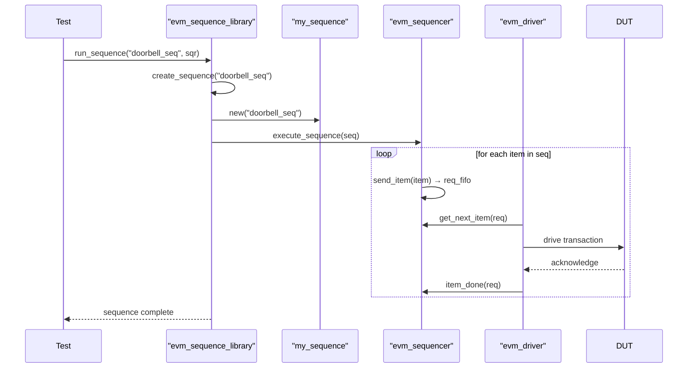
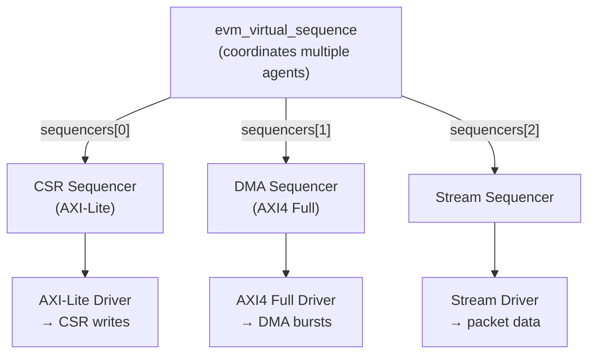

# EVM TLM Infrastructure & Sequences

**Author:** Eric Dyer (Differential Audio Inc.)  
**Last Updated:** 2026-04-09  

---

## TLM 1.0 Class Overview



---

## Sequence Infrastructure



---

## Driver ↔ Sequencer Connection



**Connection code:**
```systemverilog
// In agent connect_phase():
driver.seq_item_port.connect(
    sequencer.seq_item_export.get_req_fifo(),
    sequencer.seq_item_export.get_rsp_fifo()
);
```

---

## Monitor → Multiple Subscribers



---

## Sequence Execution Flow



---

## Virtual Sequence Pattern


